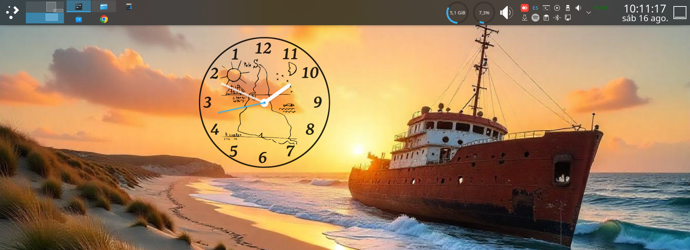

# Giro Sur Clock (Plasma Applet)

**Giro Sur Clock** is an analog clock applet for KDE Plasma, inspired by the original Plasma analog clock and the Latte dock work, but with its own unique aesthetics and behavior:  
- **Counterclockwise rotation**  
- **Inverted numbering**  
- **“South-up” map background** (inspired by Joaquín Torres-García)  

It is designed for Plasma panels and works great both on desktops and docks.

<p align="center">
  <br/>
  <i>Inverted numbering layout and counterclockwise rotation</i>
</p>

## Features

- ⏱️ **True counterclockwise rotation** (seconds, minutes and hour hands).  
- 🔢 **Inverted numbering** consistent with the counterclockwise design.  
- 🗺️ **“South-up” map background** as SVG.  
- 🖥️ **Plasma 5 and 6 compatibility**.  
- 🧩 **Works on panels and docks** (tested with Latte).  

## Requirements

- KDE Plasma 5.24+ or Plasma 6.x  
- Qt / KDE Frameworks (depending on your distribution)  
- Plasma package tools (`kpackagetool5` or `kpackagetool6`)  

## Installation

### Option A: From source
1. Clone or download this repository.  
2. In the project root, run:  


   **Plasma 5:**
   ```bash
   kpackagetool5 -t Plasma/Applet -i .

or

   **Plasma 6:**
   ```bash
   kpackagetool6 -t Plasma/Applet -i .


